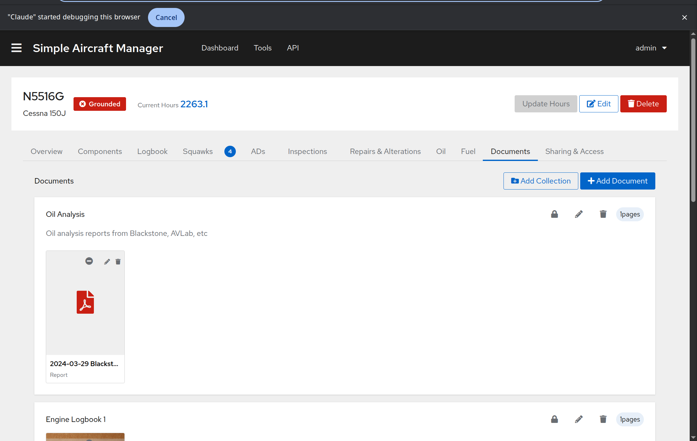

Documents
=========

The Documents tab stores and organizes aircraft-related documents such as
logbook scans, weight and balance sheets, registration certificates, and
maintenance reports.

Document Organization
---------------------

Documents can be organized into **collections** (folders) or left uncollected.

- **Collections** group related documents together (e.g., "Airframe Log #4" or
  "2024 Annual Inspection"). Each collection shows a page count badge.
- **Other Documents** -- Documents not assigned to a collection appear in an
  "Other Documents" section at the bottom.

Each document is displayed as a thumbnail card showing:

- A **preview image** of the first page (or a file-type icon for non-image
  files like PDFs).
- The **document name**.
- The **document type** label (Log, Alteration, Report, Invoice, Aircraft
  Record, or Other).

.. TODO: Screenshot of the Documents tab showing collections with thumbnail grids

Creating a Collection
---------------------

1. Click **Add Collection** (owners only).
2. Enter a **name** and optional **description**.
3. Click **Save**.

Adding a Document
-----------------

1. Click **Add Document** (owners only).
2. Fill in:

   - **Name** -- A descriptive name for the document.
   - **Document Type** -- Select the type (Log, Alteration, Report, Invoice,
     Aircraft Record, or Other).
   - **Collection** -- Optionally assign to an existing collection.
   - **Images** -- Upload one or more image files. These become the pages of
     the document.

3. Click **Save**.

.. TODO: Screenshot of the Add Document modal

Viewing Documents
-----------------

Click any document thumbnail to open the **document viewer**. The viewer shows:

- The current page at full size.
- **Thumbnail navigation** along the side to jump between pages.
- Page number indicator.

.. TODO: Screenshot of the document viewer showing a multi-page document with thumbnail sidebar

Public Sharing
--------------

Documents and collections have sharing controls that determine visibility on
public share links (see :doc:`sharing-and-access`):

**Collections** have a toggle between:

- **Globe icon** (green) -- Shared publicly. All documents in the collection
  are visible on share links (unless individually hidden).
- **Lock icon** -- Private. Not visible on share links.

**Individual documents** within a collection have three states:

- **Globe icon** (green) -- Always shared, regardless of collection setting.
- **Eye-slash icon** (red) -- Always hidden, even if the collection is shared.
- **Minus icon** -- Inherits visibility from the collection.

For uncollected documents, the toggle is simpler -- shared or private.

Editing and Deleting
--------------------

- Click the **pencil** icon on a document thumbnail to edit its name, type, or
  collection assignment.
- Click the **trash** icon to delete a document and all its pages.
- Collection editing and deletion is available via the icons in the collection
  card header. Deleting a collection does not delete the documents inside it --
  they become uncollected.
